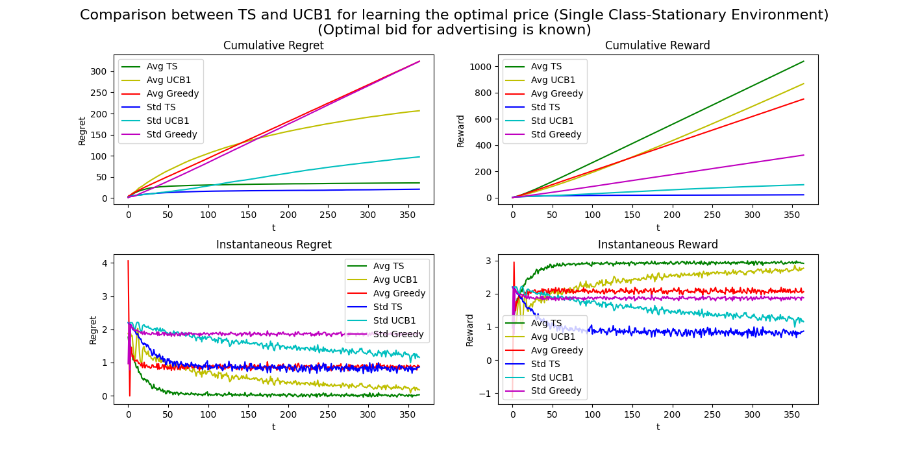
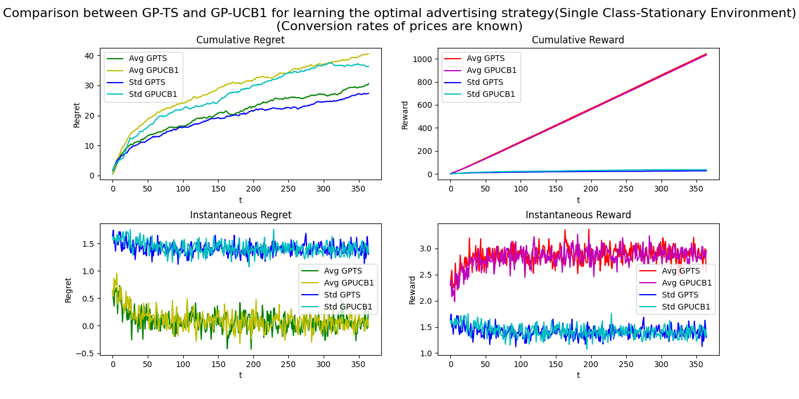
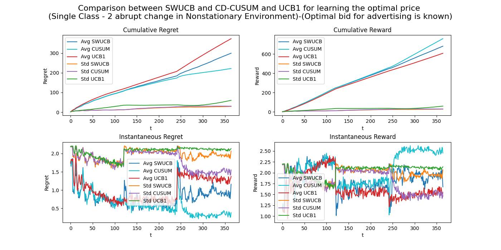

# DATA INTELLIGENCE APPLICATIONS

## Learning for Optimal Advertising and Pricing Project Report

Author: Enver Eren - 10947639

## Introduction

This report presents a simulation-based learning on the best pricing and advertising strategies for sneakers in the context of an e-commerce website. The website aims to maximize its revenue by strategically setting prices and advertising strategies based on two user features: sex, level. The users are divided into three classes: male amateur athletes, male professional athletes, and female athletes. The study involves exploring different algorithms to optimize pricing and advertising decisions.

### Environment Design

#### Application Scenario

The e-commerce platform exclusively sells sneakers, and the users are segmented into three classes based on two features: sex and level. The three classes are as follows:

1. Male Amateur Athletes (C1): This class includes male athletes who participate in sports as amateurs, not at a professional level.
2. Male Professional Athletes (C2): This class comprises elite male athletes who compete at a professional level in their respective sports.
3. Female Athletes (C3): This class represents female athletes of various levels and backgrounds.

#### Simulator Parameters

To build the simulator for the study, we consider the following parameters:

- Cost of the Product: The cost of producing a pair of sneakers is $180.
- Number of Prices (n_prices): There are five different possible prices for the sneakers, which are [100, 200, 300, 400, 500].
- Conversion Rates:

    ```python
      #C1    C2    C3
    [[0.19, 0.21, 0.16], #1*price
     [0.16, 0.17, 0.09], #2*price
     [0.15, 0.13, 0.06], #3*price
     [0.03, 0.08, 0.04], #4*price
     [0.02, 0.04, 0.06]] #5*price
    ```

- Number of Bids (n_bids): The e-commerce platform can choose from 100 possible bids to attract user clicks.
- Formula of the number of daily clicks is drawn given a bid

    ```python
    C1: 5*(1 - e^((-4*x + 2*x^3)))
    C2: 5*(1 - e^((-2*x + 2*x^3)))
    C3: 5*(1 - e^((-3*x + 2*x^3)))
    ```

- Formula of the cumulative daily click cost is drawn given a bid

    ```python
    C1: 2*(1 - e^((-3*x + 2*x^2)))
    C2: 2*(1 - e^((-2*x + 2*x^2)))
    C3: 2*(1 - e^((-3*x + 2*x^2)))
    ```

- Time Horizon: The experiments are conducted over 365 rounds (days).

### Learning for Pricing (Step 1)

In Step 1, we focus on male amateur athletes (C1) and make an assumption that the advertising-related curves are known. However, the pricing curve remains unknown. Our goal is to determine the optimal pricing strategy for this user class using the UCB1, TS, and Greedy (Naive) algorithms. We closely examine the cumulative regret, cumulative reward, instantaneous regret, and instantaneous reward to evaluate the algorithms' performance. The design of the algorithms and their properties is as follows:

1. Conversion Rate Adjustment: To ensure sensible conversion rates, we multiply each row of the conversion rate matrix by the corresponding margin. Then, we normalize the obtained conversion rates to obtain probabilities of conversion, as the learning algorithms require values between 0 and 1. In this step, we focus solely on the conversion rates of the first class.

2. Sampled Rewards Calculation: Given that the optimal bid for advertising is known, we calculate sampled rewards by multiplying the sampled reward for pricing (predicted by the learning algorithms and determined by environment) with the known number_of_daily_clicks (optimal_bid) minus the known cumulative_daily_click_cost (optimal_bid).

3. Multiple Simulations: To ensure robustness in our evaluations, we conduct 1000 simulations. For each simulation, we calculate the average value and standard deviation of the cumulative regret, cumulative reward, instantaneous regret, and instantaneous reward.

The results are visually presented in the following figures:



Based on the above findings, the TS algorithm outperforms the other two algorithms in terms of cumulative regret and cumulative reward. Additionally, the UCB1 algorithm exhibits better performance compared to the Greedy algorithm, which serves as the baseline (naive) approach. While the TS algorithm yields the best results, the UCB1 algorithm is also a valuable option, as it outperformed the Greedy algorithm, which is a simplistic baseline method. These insights highlight the effectiveness of our proposed approaches in determining the optimal pricing strategy for male amateur athletes.

### Learning for Advertising (Step 2)

In Step 2, we shift our focus to the advertising aspect of the problem, assuming that the curves related to the pricing part are already known. However, the advertising-related curves remain unknown. The problem's reward is calculated as `number_of_daily_clicks(bid) * best_normalized_conversion_rate - cumulative_daily_click_cost(bid)`. Since `best_normalized_conversion_rate` is known and constant, our objective is to directly learn the reward curve for male amateur athletes (C1) using the GPTS and GPUCB algorithms.

To achieve this, we employ the following steps:

1. Concave Functions and Linear Combination: We observe that the concave functions in our scenario are linearly independent (verified through the Wronskian of the functions). Consequently, their linear combination remains concave. Hence, we utilize this linear combination of functions as the reward function.

2. Algorithm Evaluation: We utilize GPTS and GPUCB algorithms to learn the reward curve. In our evaluation, we calculate the average value and standard deviation of the cumulative regret, cumulative reward, instantaneous regret, and instantaneous reward over 100 simulations. The results are visually presented in the following figures:



Based on the above findings, the GPTS algorithm outperforms the GPUCB algorithm in terms of cumulative regret. While there are minor differences between the two algorithms in cumulative regret and reward, both methods show promising results.

3. Step-by-step Predictions: Additionally, we provide a detailed view of the reward curve predictions made by the GPTS and GPUCB algorithms from the first iteration to the last iteration (with intervals of 13 iterations), as illustrated in the figures below:


These figures demonstrate that learning the linearly combined concave functions using the Gaussian process works effectively, as the concavity of the functions is preserved in the reward function.

The successful learning of the reward function indicates the potential effectiveness of our approach in optimizing the advertising strategy for male amateur athletes.

### Learning for Pricing and Advertising (Step 3)

In Step 3, our focus extends to both the pricing and advertising aspects of the problem, assuming that the curves related to both are unknown. Our goal is to simultaneously learn the optimal pricing and advertising strategies for male amateur athletes (C1) using the GPTS and GPUCB algorithms.

The advertising algorithm's learning process relies on knowing the conversion rate, but in our case, none of the curves and conversion rates are known. Consequently, we face the challenge of predicting both the best pricing strategy and the advertising strategy simultaneously. To achieve this, we use the available data at the current iteration to predict the optimal pricing strategy, which is then utilized in predicting the advertising strategy for the same iteration. Although this simultaneous prediction approach allows us to deal with the complexity of unknown curves and conversion rates efficiently, it is reasonable to expect larger regret compared to Steps 1 and 2.

To evaluate the effectiveness of this approach, we calculate the average value and standard deviation of the cumulative regret, cumulative reward, instantaneous regret, and instantaneous reward over 100 simulations. The results are visually presented in the following figures:


As observed above,the GPTS algorithm still outperforms the GPUCB algorithm in terms of cumulative regret. However, the cumulative regrets are larger compared to those in Steps 1 and 2.

Additionally, we present step-by-step predictions of the reward curve using the GPTS and GPUCB algorithms:


During Step 3, we attempted to learn advertising curves separately. Since the conversion rate for the optimal price is unknown, the sampled rewards may not entirely suit the concavity while updating the Gaussian process regressor. Furthermore, in GPUCB, the lower bound of the predicted cumulative_daily_click_cost curve is used to be optimistic. While this approach aims to find the smallest cost, it may result in the algorithm performing poorly in discovering new options if an upper bound for the cost curve were to be used for selection.

Despite these challenges, the combined GPTS and GPUCB learning approach showcases the potential of simultaneously optimizing pricing and advertising strategies for male amateur athletes.

### Dealing with Non-Stationary Environments with Two Abrupt Changes (Step 5)

Step 5 comprises two parts, each addressing the implementation of abrupt changes in the environment and evaluating the performance of learning algorithms SWUCB, CD-CUSUM, and UCB1, assuming that the curves related to advertising are known. The focus remains on optimizing the pricing strategy, similar to Step 1, but in Step 5, we encounter three different phases, each with its distinct optimal pricing strategy. The primary objective of the first part of step 5 is to compare how the learning algorithms react to abrupt changes in the non-stationary environment whose conversion rates for three different phase given below:

```python
                                    # normal economic conditions
                                      #C1   C2   C3
conversion_rate_phase1 =  np.array([[0.19,0.21,0.16], #1*price
                                    [0.16,0.17,0.09], #2*price
                                    [0.15,0.13,0.06], #3*price
                                    [0.03,0.08,0.04], #4*price
                                    [0.02,0.04,0.06]  #5*price
                                    ])

                                    # bad economic conditions
                                      #C1   C2   C3
conversion_rate_phase2 =  np.array([[0.24,0.20,0.16],  # 1*price
                                    [0.48,0.18,0.10],  # 2*price
                                    [0.03,0.10,0.08],  # 3*price
                                    [0.02,0.03,0.07],  # 4*price
                                    [0.01,0.02,0.05]   # 5*price
                                    ])

                                    # good economic conditions
                                      #C1   C2   C3
conversion_rate_phase3 =  np.array([[0.20,0.17,0.22],  # 1*price
                                    [0.07,0.15,0.15],  # 2*price
                                    [0.09,0.10,0.13],  # 3*price
                                    [0.11,0.11,0.12],  # 4*price
                                    [0.11,0.12,0.10]   # 5*price
                                    ])
```

We calculate the average value and standard deviation of the cumulative regret, cumulative reward, instantaneous regret, and instantaneous reward over 1000 simulations, and the results are visually presented in the following figures:



As observed above, the CD-CUSUM algorithm outperforms the SWUCB and UCB1 algorithms in terms of cumulative regret. Additionally, the sliding window UCB algorithm performs better than the UCB1 algorithm, which tends to poorly react to changes in the environment.

In the second part of Step 5, we conduct sensitivity analysis for the SWUCB and CD-CUSUM algorithms to examine their response to various parameter settings. Our aim is to explore how these algorithms' performance varies with different parameters. We calculate the average value and standard deviation of the cumulative regret for the algorithms with different parameters over 1000 simulations, and the results are presented in the following figures:

.png)

In a non-stationary environment, it is typically expected that the SWUCB algorithm would perform worse with a window size larger than the real phase length. However, surprisingly, our analysis shows the opposite. The reason for this unexpected outcome could be that the non-stationary environment we constructed is partially not sufficiently turbulent. I use the term "partially" because, as we observed in the first part of Step 5, the SWUCB algorithm outperformed the UCB algorithm in the same non-stationary environment.